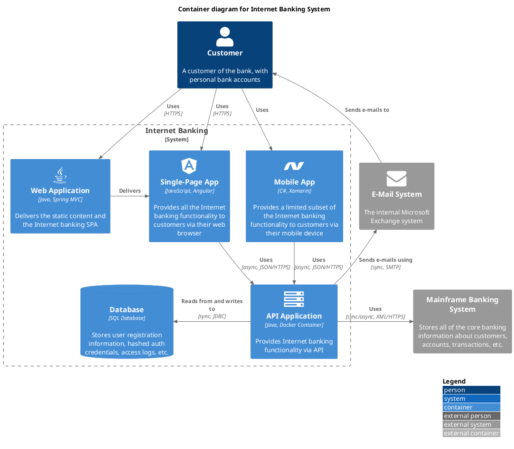

# [Example] Container

This is an example from MIT code from the C4 stdlib plugin.

https://github.com/plantuml-stdlib/C4-PlantUML/blob/master/samples/C4_Container%20Diagram%20Sample%20-%20bigbankplc-icons.puml