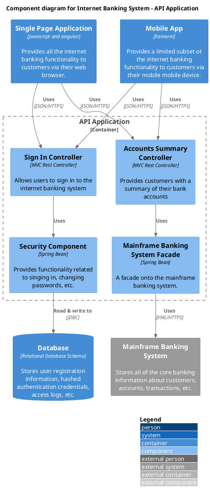

# [Example] Component

This is an example from MIT code from the C4 stdlib plugin.

https://github.com/plantuml-stdlib/C4-PlantUML/blob/master/samples/C4_Component%20Diagram%20Sample%20-%20bigbankplc.puml