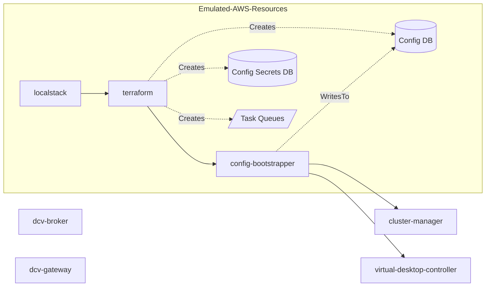

# Local Deployment Workflow

```mermaid
graph LR
  dcv-broker
  dcv-gateway
  config-bootstrapper --> cluster-manager
  config-bootstrapper --> virtual-desktop-controller

  subgraph Emulated-AWS-Resources
    localstack --> terraform
    terraform -. Creates .-> config-db[(Config DB)]
    terraform -. Creates .-> config-secrets[(Config Secrets DB)]
    terraform -. Creates .-> sqs[/Task Queues/]
    terraform --> config-bootstrapper -. WritesTo .-> config-db

  end

```