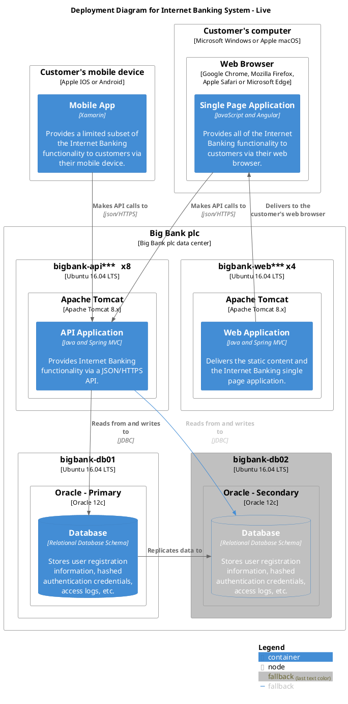
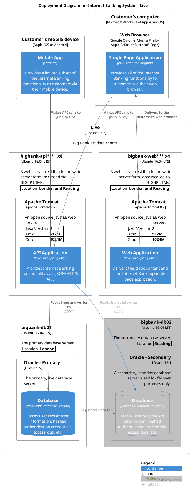

# [Example] Deployment

## No Details

This is an example from MIT code from the C4 stdlib plugin.

https://github.com/plantuml-stdlib/C4-PlantUML/blob/master/samples/C4_Deployment%20Diagram%20Sample%20-%20bigbankplc.puml

## With Details

This is an example from MIT code from the C4 stdlib plugin.

https://github.com/plantuml-stdlib/C4-PlantUML/blob/master/samples/C4_Deployment%20Diagram%20Sample%20-%20bigbankplc-details.puml